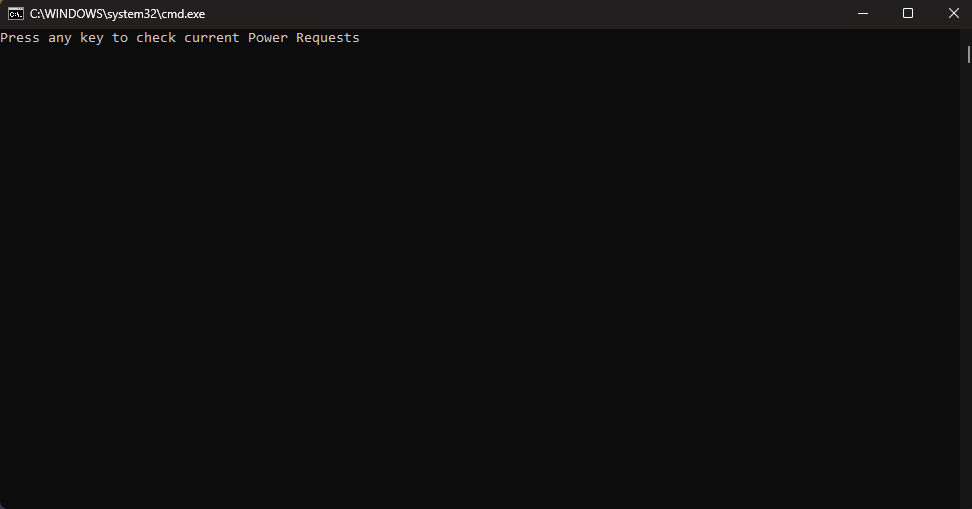

# PowerRequests
 A Simple Script to run powercfg /requests

 Handy for checking what is preventing your Windows PC from sleeping.

 Note: Must be run as Administrator, prompt will appear before running.

